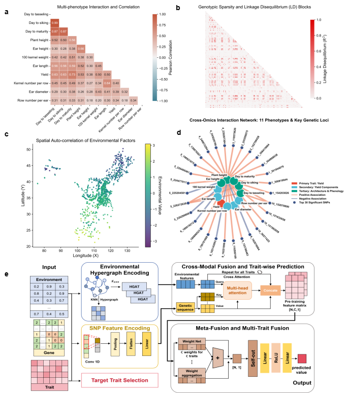

# HyperGEP
# 🌽 HyperGEP: Decoupled Hypergraph Neural Network for Joint Gene-Environment ModelingOfficial PyTorch implementation of the framework described in "A decoupled hypergraph neural network resolves genotype-environment interactions in maize multi-trait prediction".
HyperGEP provides a highly scalable computational solution for dissecting crop environmental adaptation and accelerating climate-resilient design breeding. By addressing the gradient conflicts across pleiotropic traits induced by early feature coupling, this decoupled two-stage deep learning framework accurately captures non-stationary spatial environmental gradients and resolves complex genotype-environment (G $\times$ E) interactions.

<p align="center">
    
</p>

# 🌟 Key Methodological Advances
Hypergraph Attention Network: Extracts higher-order climatic topologies and non-stationary spatial environmental gradients, operating in parallel with the genotypic encoder.
Decoupled Parallel Encoding: Utilizes independent modules for genotype and environment feature extraction, effectively preventing gradient conflicts across pleiotropic traits.
Predictive-Space Meta-Attention: Dynamically allocates task-specific weights to fuse distinct representations, mitigating task conflict and preventing negative transfer.
Structural Robustness: Demonstrates exceptional resilience against environmental noise, rigorously validated through strict leave-one-environment-out (LOEO) cross-validation across 11 agronomic traits.
Physical Interpretability: Gradient-based saliency mapping physically co-localizes the highest-weighted predictors with established developmental genes (e.g., GID1L2 and SPL) and identifies novel unannotated epistatic loci.

# 📂 Repository Structure
Based on the project architecture, the codebase is organized as follows:

```text
HyperGEP/
├── dataset/
│   ├── __init__.py
│   └── dataset.py          # Data loading logic for genomics, environments, and phenotypes
├── models/
│   ├── env_encode.py       # Hypergraph attention network for climatic topologies
│   ├── fusion.py           # Predictive-space meta-attention mechanism
│   └── snp_encode.py       # Genotypic convolutional encoder
├── utils/
│   ├── graph.py            # Hypergraph construction and topology utilities
│   └── metrics.py          # Evaluation metrics (e.g., predictive ability, LOEO CV)
└── train.py                # Main training and evaluation pipeline
```

# 🛠️ Environment & Installation
Requires Python ≥ 3.8 and PyTorch ≥ 1.10. A CUDA-enabled environment is strictly required for efficient hypergraph and convolutional operations.

# Clone the repository
git clone https://github.com/your-username/HyperGEP.git
cd HyperGEP

# Install dependencies
# 1.Give priority to using the PyTorch CUDA 11.8 source to install the core deep learning packages
pip install torch==2.4.1+cu118 torchvision==0.19.1+cu118 torchaudio==2.4.1+cu118 --extra-index-url https://download.pytorch.org/whl/cu118

# 2. Install the remaining project dependencies
pip install -r requirements.txt
Core dependencies: torch, numpy, pandas, scipy, scikit-learn, networkx.
# 💾 Data Preparation
The model requires three primary data modalities. Data loading and preprocessing are handled via dataset/dataset.py.

Genotype Data: Matrix of SNP markers.

Shape: [N, L] (N = individuals/samples, L = SNP loci).

Environment Data: Climatic and topological features used by utils/graph.py to construct the hypergraph.

Shape: [E, F] (E = environments, F = environmental features).

Phenotype Data: Target agronomic traits across diverse environments.

Shape: [N, T] (N = individuals/samples, T = traits).

# 🚀 Quick Start
The entire modeling pipeline, from parallel encoding to prediction-space fusion, is executed through train.py.

# Execute the main training pipeline with default configurations
python train.py
Module Breakdown
Environmental Encoding: Handled by models/env_encode.py, this module processes the hypergraph structures generated by utils/graph.py to learn environmental embeddings.

Genotypic Encoding: Handled by models/snp_encode.py, this module isolates genetic trait patterns via a convolutional architecture.

Fusion & Prediction: models/fusion.py executes the meta-attention weighting to output the final multi-trait predictions without inducing negative transfer.

# 🗂️ Datasets
The framework has been rigorously evaluated on large-scale maize cohorts:

MaizeGEP: Large-scale maize genotype-environment-phenotype dataset.

Genomes to Fields (G2F): Extensive multi-environment maize trials.

(Note: Please ensure you comply with the respective data usage agreements when downloading these datasets from their official repositories.)

# 🎓 Citation
If this framework assists your research in quantitative genetics or computational biology, please cite our manuscript:
Zhang Q., Wang, J., Zhang, Y., Li, B., Zhang, B., Zhao, X., Wang, Y., Piao, X., Zhang, B., & Wang, K.. A decoupled hypergraph neural network resolves genotype-environment interactions in maize multi-trait prediction.

# 📄 License
This project is licensed under the MIT License.
